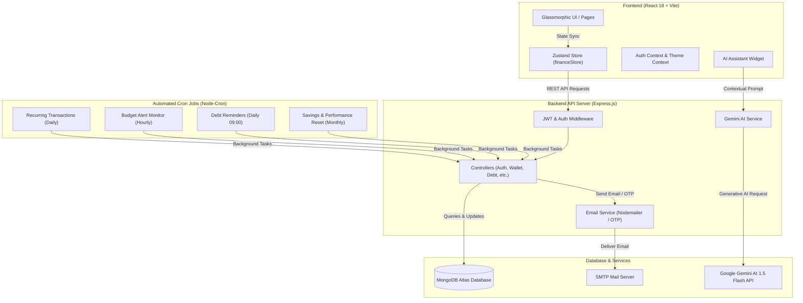
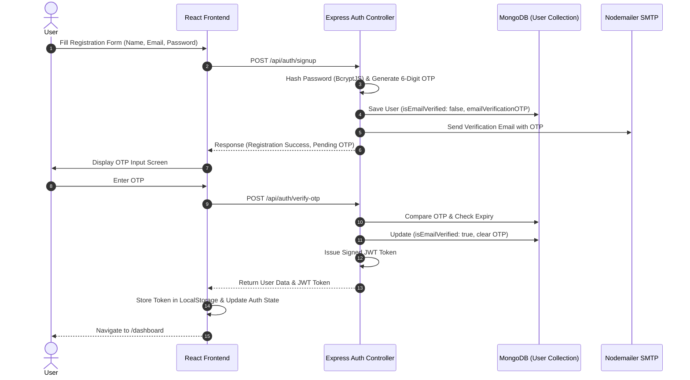
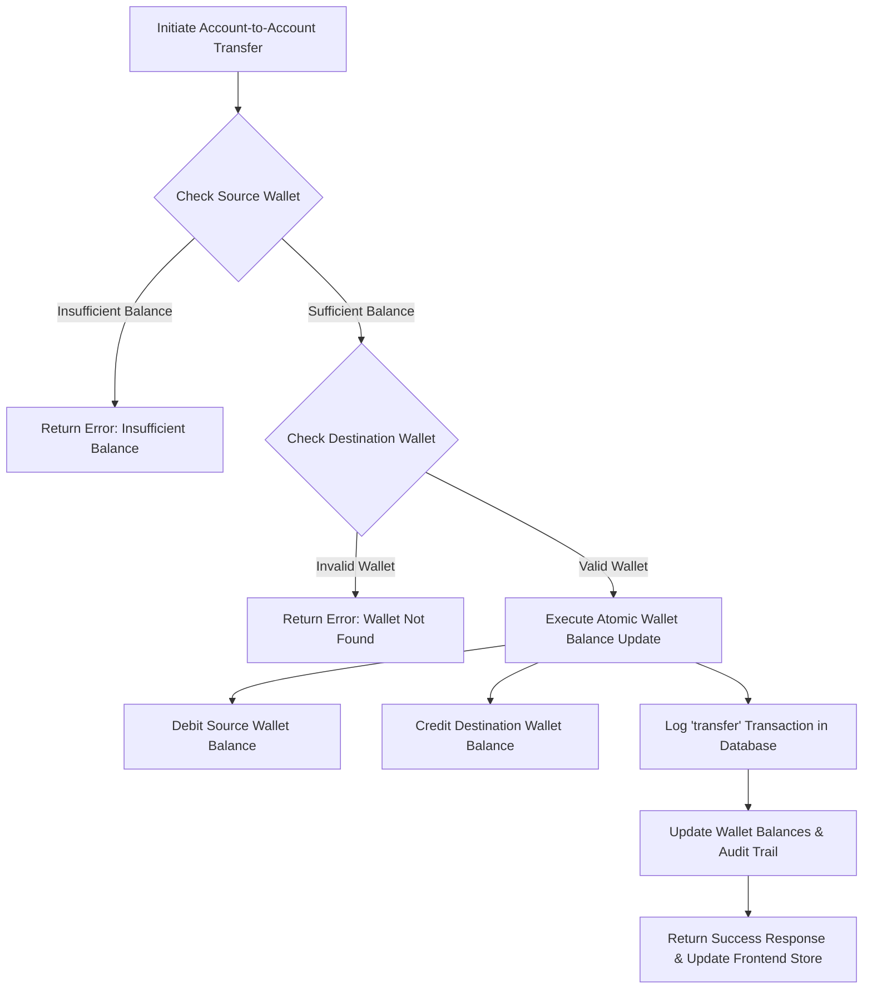
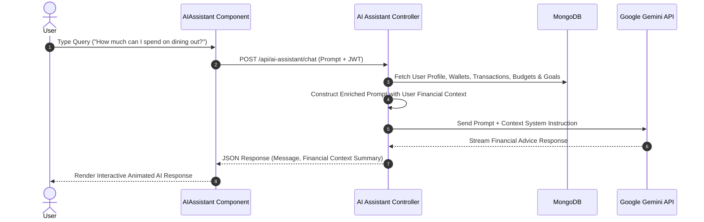
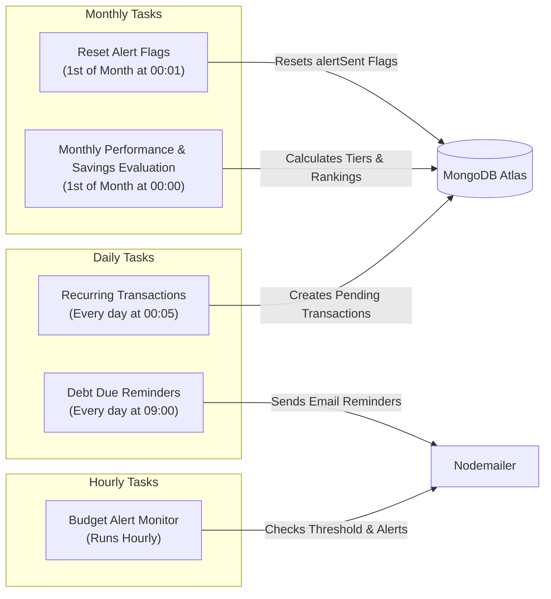

# 💼 BachatSaathi - Intelligent Personal Finance Management System

> **BachatSaathi** (meaning *Savings Companion*) is a full-stack, enterprise-grade personal finance management system designed to streamline daily financial operations, expense tracking, and long-term wealth building. Built on the modern MERN stack (MongoDB, Express.js, React 18 + Vite, Node.js), it combines multi-wallet balance consolidation, automated budget & debt monitoring, interactive visual analytics, and multi-format reporting with Google Gemini AI-driven financial assistance.

---

## 📌 Problem Statement

Managing personal finances effectively remains a significant challenge for individuals due to operational and tracking hurdles:

1. **Fragmented Asset & Liability Visibility**: Modern users store funds across diverse containers (Cash, Bank Accounts, Credit Cards, Investments, and Savings). Tracking consolidated net worth manually leads to balance discrepancies, unexpected debt accrual, and unmonitored spending.
2. **Lack of Active Budget Controls**: Manual expense logging without real-time threshold monitoring often leads to unnoticed category overspending and budget fatigue.
3. **Passive & Reactive Financial Awareness**: Conventional tools log historical data without proactively warning users about upcoming debt obligations, category budget overspends, or recurring subscription charges before they occur.
4. **Generic Financial Guidance**: Spreadsheets and basic expense trackers lack context-aware, personalized guidance tailored to an individual's live cash flow, liabilities, and active financial goals.

---

## 💡 Why Needed

Achieving long-term financial health requires consistent tracking, precise accounting, proactive alerts, and structured goal planning. **BachatSaathi** addresses this by providing:

* **Unified Financial Nerve Center**: Real-time aggregation of multi-wallet balances, net worth calculations, transaction histories, and transfer audit logs in a single dashboard.
* **Proactive Budget & Debt Alerts**: Automated background cron tasks monitoring category spending limits, upcoming debt payment dates, and scheduled recurring bills, triggering automated email notifications before issues arise.
* **Structured Savings & Performance Benchmarks**: Standardized monthly savings tiers (Bronze to Diamond), goal tracking milestones, and financial progress analytics to foster consistent financial discipline.
* **Context-Aware AI Advisory**: Embedded Google Gemini 1.5 Flash assistant providing tailored financial recommendations based on live database snapshots of user cash flows.

---

## 🏗️ Why Built

**BachatSaathi** was engineered as a robust, production-ready solution demonstrating high-performance web development, strict security standards, and asynchronous background automation:

* **Full-Stack Architecture**: Clean separation of concerns with React 18 + Vite on the frontend and Express.js + MongoDB Mongoose on the backend.
* **State & Data Integrity**: Performant client-side state management using Zustand, stateless JWT authentication, and multi-step verification via BcryptJS and Email OTP.
* **Automated Server Processing**: Server-side background jobs via `node-cron` to automatically execute scheduled payments, evaluate monthly savings performance, send debt notifications, and clear budget alert flags.

---

## 📐 System Flows & Diagrams

### 1. Overall Architecture Flow



---

### 2. User Authentication & Email OTP Verification Flow



---

### 3. Multi-Wallet Balance & Transfer Flow



---

### 4. AI Financial Assistant Context Injection Workflow



---

### 5. Automated Background Cron Jobs Lifecycle Flow



---

## 📦 What's in the Project

Every feature, route, schema, component, and utility listed below exists directly within this codebase.

### 1. Core Modules & Features

* 🏦 **Multi-Wallet Account Management (`/wallets`)**
  * Support for Cash, Bank Accounts, Credit Cards, Savings, and Investments.
  * 24-hour protection buffer system for newly created wallets.
  * Inter-wallet fund transfers with full balance reconciliation and audit trails.

* 💸 **Transaction & Cash Flow Tracking Engine (`/transactions`, `/transfers`)**
  * Full CRUD operations for Income, Expense, and Transfer logs.
  * Granular categorization (Food, Housing, Utilities, Transportation, Entertainment, Investment, etc.).
  * Real-time metadata filtering, date-range searching, and transaction summary stats.

* 📉 **Category Budgeting & Automated Overspend Alerts (`/budgets`)**
  * Monthly budget allocations per spending category.
  * Visual progress indicators with automated alert threshold tracking.
  * Automated email notification dispatch when category limits are approached or breached.

* 📑 **Debt Repayment Vault & Liability Tracking (`/debts`)**
  * Liabilities management (Loans, Credit Cards, Personal IOUs).
  * Repayment schedule tracking, minimum payment monitors, and deposit logs.
  * Dynamic progress visualizers showing proximity to debt freedom.

* 🎯 **Aspirational Goal Tracking & Savings Planning (`/goals`)**
  * Target amount, deadline date, icon, and category configuration.
  * Contribution deposits recording with real-time percentage progress bars.

* 📈 **Savings Benchmarks & Financial Progress (`/achievements`, `/leaderboard`, `/points-info`)**
  * **Monthly Savings Tiers**: Standardized performance tiers (Bronze, Silver, Gold, Platinum, Diamond) calculated on net savings rate.
  * **Financial Milestones**: Track key achievements like consistent budget adherence and debt payoff completion.
  * **Community Rankings**: Optional opt-in community performance benchmarks based on savings discipline.

* 🤖 **BachatSaathi AI Financial Assistant (`AIAssistant.jsx`)**
  * Floating interactive UI assistant present across protected routes.
  * Real-time financial guidance powered by Google Gemini 1.5 Flash using live database snapshots.

* 📊 **Visual Analytics & Report Exporter (`/reports`)**
  * Interactive financial visual analytics via Recharts (Bar Charts, Line Charts, Donut Category Charts).
  * Professional export options: Download financial statements in high-resolution **PDF** (via `pdfkit`) or **CSV** (via `json2csv`).

* 🔐 **Security & Account Management (`/profile`, `/login`, `/signup`, `/forgot-password`)**
  * Email OTP verification for account signup and password resetting.
  * Password strength evaluator, profile customization, dark/light theme toggle.

---

### 2. Database Models (`backend/models/`)

| Model | File | Key Attributes |
| :--- | :--- | :--- |
| **User** | `User.js` | Name, Email, Hashed Password, Profile Picture, Points, Level, Achievements, Savings Rate, Email OTP, Reset Token |
| **Wallet** | `Wallet.js` | User ID, Name, Type (Cash, Bank, Credit Card, Savings, Investment), Balance, Currency, Protected Until, Default Flag |
| **Transaction** | `Transaction.js` | User ID, Wallet ID, Type (Income, Expense, Transfer), Amount, Category, Description, Date, Transfer Target Wallet |
| **Budget** | `Budget.js` | User ID, Category, Amount Limit, Spent Amount, Month, Year, Alert Threshold %, Alert Sent Flag |
| **Debt** | `Debt.js` | User ID, Name, Total Amount, Remaining Amount, Interest Rate, Minimum Payment, Due Date, Payment History |
| **Goal** | `Goal.js` | User ID, Name, Target Amount, Current Amount, Deadline, Category, Status (in_progress, completed) |
| **Leaderboard** | `Leaderboard.js` | User ID, Rank, Points, Level, Monthly Savings, Badges, Streak Count |
| **MonthlySavingsTier** | `MonthlySavingsTier.js` | User ID, Month, Year, Saved Amount, Total Income, Tier (Bronze to Diamond), Points Awarded |
| **NetWorth** | `NetWorth.js` | User ID, Total Assets, Total Liabilities, Calculated Net Worth, Timestamp |
| **PointsLog** | `PointsLog.js` | User ID, Points Change, Reason, Source, Timestamp |
| **RecurringRule** | `RecurringRule.js` | User ID, Wallet ID, Type, Amount, Category, Frequency (daily, weekly, monthly, yearly), Next Run Date |
| **Contact** | `Contact.js` | Name, Email, Subject, Message, Status |

---

### 3. Backend Cron Jobs (`backend/cronJobs/`)

| Cron Script | Schedule | Purpose |
| :--- | :--- | :--- |
| `recurringTransactions.js` | Daily at `00:05` | Executes due recurring rules, updating wallet balances and logging transactions. |
| `budgetAlertMonitor.js` | Hourly | Scans active category budgets and sends email alerts when limits reach warning thresholds. |
| `resetBudgetAlerts.js` | 1st of month at `00:01` | Resets `alertSent` flags for all category budgets for the new monthly cycle. |
| `debtReminders.js` | Daily at `09:00` | Sends email reminders for debts approaching their due date within 3 days. |
| `leaderboardReset.js` | 1st of month at `00:00` | Computes monthly savings rates, assigns performance tiers, and updates community rankings. |

---

### 4. API Endpoints Reference

```
/api/auth
  POST /signup             - Register new user & dispatch OTP
  POST /verify-otp         - Verify registration OTP & issue JWT
  POST /resend-otp         - Resend verification OTP
  POST /login              - Authenticate user & return JWT
  POST /forgot-password    - Request password reset OTP
  POST /reset-password     - Reset password with OTP

/api/wallets
  GET  /                   - Get all user wallets
  POST /                   - Create a new wallet
  PUT  /:id                - Update wallet details
  DELETE /:id              - Remove wallet
  POST /transfer           - Execute inter-wallet fund transfer

/api/transactions
  GET  /                   - Get user transactions (with filters)
  POST /                   - Log new income or expense
  PUT  /:id                - Update transaction
  DELETE /:id              - Delete transaction
  GET  /stats              - Get financial statistics summary

/api/budgets
  GET  /                   - Fetch user category budgets
  POST /                   - Set budget limit
  PUT  /:id                - Edit budget limit / threshold
  DELETE /:id              - Remove budget

/api/debts
  GET  /                   - List tracked debts
  POST /                   - Add new debt entry
  PUT  /:id                - Update debt entry
  DELETE /:id              - Remove debt entry
  POST /:id/pay            - Record payment against debt

/api/goals
  GET  /                   - Retrieve financial goals
  POST /                   - Create new financial goal
  PUT  /:id                - Update goal details
  DELETE /:id              - Delete goal
  POST /:id/deposit        - Add contribution deposit to goal

/api/reports
  GET  /summary            - Retrieve summary metrics for reports
  GET  /export/csv         - Download transaction & financial data CSV
  GET  /export/pdf         - Generate & stream PDF financial statement

/api/leaderboard
  GET  /                   - Get global community rankings
  GET  /user-rank          - Fetch authenticated user's current rank

/api/monthly-tiers
  GET  /current            - Get current month's calculated savings tier
  GET  /history            - View historical tier badges

/api/ai-assistant
  POST /chat               - Query AI Assistant with user financial context

/api/insights
  GET  /spending-by-category - Fetch category breakdown analytics
  GET  /cashflow-trends      - Fetch income vs. expense trend lines

/api/recurring
  GET  /                   - Fetch active recurring transaction rules
  POST /                   - Define new recurring payment/income rule
  PUT  /:id                - Update recurring rule
  DELETE /:id              - Delete recurring rule

/api/users
  GET  /profile            - Get authenticated user profile
  PUT  /profile            - Update profile details
  PUT  /change-password    - Change user account password

/api/contact
  POST /                   - Submit contact / support form message
```

---

## 🛠️ Technology Stack

### Frontend
* **Core Framework**: React 18 + Vite
* **State Management**: Zustand (`financeStore.js`)
* **Routing**: React Router DOM (`HistoryRouter`)
* **Styling**: Tailwind CSS with custom glassmorphic utility classes
* **Animations**: Framer Motion & Lucide React icons
* **Data Visualization**: Recharts (Line, Bar, Donut charts)
* **Notifications**: React Hot Toast
* **HTTP Client**: Axios (configured with Authorization Interceptors)

### Backend
* **Runtime**: Node.js
* **Framework**: Express.js
* **Database**: MongoDB Atlas via Mongoose ODM
* **Authentication**: JWT (JSON Web Tokens) & BcryptJS
* **AI Engine**: Google Generative AI (`@google/generative-ai` - Gemini 1.5 Flash)
* **Task Automation**: Node-cron (`node-cron`)
* **Mailing**: Nodemailer (SMTP OTP & alerts)
* **Reporting**: `pdfkit` (PDF Generation) & `json2csv` (CSV Export)

---

## 📂 Project Structure

```
BachatSaathi/
├── backend/
│   ├── api/
│   │   └── index.js                 # Vercel serverless entry point
│   ├── config/
│   │   ├── gemini.js                # Google Gemini SDK configuration
│   │   └── jwt.js                   # JWT secret configuration
│   ├── controllers/                 # Route logic controllers
│   │   ├── aiAssistantController.js
│   │   ├── authController.js
│   │   ├── budgetController.js
│   │   ├── debtController.js
│   │   ├── goalController.js
│   │   ├── insightController.js
│   │   ├── leaderboardController.js
│   │   ├── monthlySavingsTierController.js
│   │   ├── recurringController.js
│   │   ├── reportController.js
│   │   ├── transactionController.js
│   │   ├── userController.js
│   │   └── walletController.js
│   ├── cronJobs/                    # Automated scheduled background tasks
│   │   ├── budgetAlertMonitor.js
│   │   ├── debtReminders.js
│   │   ├── leaderboardReset.js
│   │   ├── recurringTransactions.js
│   │   └── resetBudgetAlerts.js
│   ├── middleware/
│   │   ├── auth.js                  # JWT route protection middleware
│   │   └── cache.js                 # API response caching middleware
│   ├── models/                      # Mongoose Database Schemas
│   │   ├── Budget.js
│   │   ├── Contact.js
│   │   ├── Debt.js
│   │   ├── Goal.js
│   │   ├── Leaderboard.js
│   │   ├── MonthlySavingsTier.js
│   │   ├── NetWorth.js
│   │   ├── PointsLog.js
│   │   ├── RecurringRule.js
│   │   ├── Transaction.js
│   │   ├── User.js
│   │   └── Wallet.js
│   ├── routes/                      # Express route endpoints
│   ├── services/
│   │   ├── geminiService.js         # Gemini API invocation logic
│   │   └── leaderboardService.js    # Leaderboard recalculation algorithms
│   ├── utils/
│   │   ├── authMiddleware.js
│   │   ├── categoryTagger.js
│   │   ├── emailService.js          # Nodemailer OTP & Alert dispatcher
│   │   ├── jwt.js
│   │   ├── logger.js
│   │   ├── monthlySavingsCalculator.js
│   │   └── passport-setup.js        # Google OAuth configuration
│   ├── app.js                       # Express app configuration & middleware
│   ├── server.js                    # Database connection & server initialization
│   └── package.json
│
├── frontend/
│   ├── src/
│   │   ├── components/
│   │   │   ├── landing/             # Public landing page sections
│   │   │   ├── ui/                  # Reusable UI primitives
│   │   │   ├── AIAssistant.jsx      # Floating AI Assistant widget
│   │   │   ├── BarChart.jsx
│   │   │   ├── BudgetForm.jsx
│   │   │   ├── DonutChart.jsx
│   │   │   ├── LineChart.jsx
│   │   │   ├── Navbar.jsx
│   │   │   ├── NavigationLinks.jsx
│   │   │   ├── Sidebar.jsx
│   │   │   ├── ThemeToggle.jsx
│   │   │   ├── TransactionForm.jsx
│   │   │   └── WalletCard.jsx
│   │   ├── contexts/
│   │   │   ├── AuthContext.jsx       # Authentication state & provider
│   │   │   └── ThemeContext.jsx      # Light / Dark theme state provider
│   │   ├── hooks/
│   │   │   └── visit_log.js          # Visitor tracking hook
│   │   ├── pages/                   # Application page views
│   │   │   ├── Achievements.jsx
│   │   │   ├── Budgets.jsx
│   │   │   ├── Dashboard.jsx
│   │   │   ├── DebtTracker.jsx
│   │   │   ├── ForgotPassword.jsx
│   │   │   ├── Goals.jsx
│   │   │   ├── Landing.jsx
│   │   │   ├── Leaderboard.jsx
│   │   │   ├── Login.jsx
│   │   │   ├── PointsInfoPage.jsx
│   │   │   ├── Profile.jsx
│   │   │   ├── Reports.jsx
│   │   │   ├── Signup.jsx
│   │   │   ├── Transactions.jsx
│   │   │   ├── TransferHistory.jsx
│   │   │   └── Wallets.jsx
│   │   ├── services/
│   │   │   ├── api.js                # Axios API instance configuration
│   │   │   └── contactService.js
│   │   ├── stores/
│   │   │   └── financeStore.js       # Central Zustand global store
│   │   ├── App.jsx                   # React Router routing setup & layout guards
│   │   ├── main.jsx                  # React application DOM root mount
│   │   └── index.css                 # Global Tailwind CSS styles
│   ├── package.json
│   ├── tailwind.config.js
│   └── vite.config.js
│
└── README.md
```

---

## 🚀 Installation & Setup Guide

### Prerequisites
* **Node.js**: v18.x or higher
* **MongoDB**: Local MongoDB instance or MongoDB Atlas Connection URI
* **Google Gemini API Key**: Obtainable from Google AI Studio
* **SMTP Credentials**: Gmail or custom SMTP service for sending OTPs and alerts

---

### Step 1: Clone the Repository

```bash
git clone https://github.com/heyaryanmittal/bachatSaathi.git
cd BachatSaathi
```

---

### Step 2: Configure & Start Backend Server

1. Navigate to `backend` directory:
   ```bash
   cd backend
   ```

2. Create a `.env` file inside `backend/`:
   ```env
   PORT=5001
   MONGODB_URI=mongodb+srv://<username>:<password>@cluster.mongodb.net/bachatSaathi?retryWrites=true&w=majority
   JWT_SECRET=your_super_secret_jwt_key
   GEMINI_API_KEY=your_google_gemini_api_key
   EMAIL_USER=your_email@gmail.com
   EMAIL_PASS=your_email_app_password
   ```

3. Install dependencies and launch server:
   ```bash
   npm install
   npm run dev
   ```
   *The backend server will launch on `http://localhost:5001`.*

---

### Step 3: Configure & Start Frontend Client

1. Open a new terminal and navigate to `frontend` directory:
   ```bash
   cd frontend
   ```

2. Create a `.env` file inside `frontend/`:
   ```env
   VITE_API_URL=http://localhost:5001/api
   ```

3. Install dependencies and start development server:
   ```bash
   npm install
   npm run dev
   ```
   *The React development server will start on `http://localhost:5173` (or available port).*

---

## 🛡️ Security Measures

* **JWT Stateless Auth**: Bearer tokens verified via Express middleware on all private routes.
* **Email Verification (OTP)**: Mandatory 6-digit OTP verification prior to enabling full user access.
* **Bcrypt Password Hashing**: Passwords salt-hashed with `bcryptjs` before persistent storage.
* **Input Validation & Sanitization**: Strict payload validation across financial creation/update routes.
* **Environment Secret Isolation**: API keys, database connection strings, and SMTP secrets strictly bounded to server runtime environment variables.

---

<div align="center">
  <p><b>BachatSaathi</b> — <i>Empowering financial stability through intelligent tracking, automated budget protection, and data-driven insights.</i></p>
</div>
